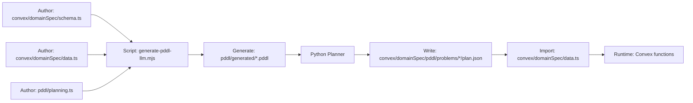

# PDDL Artifacts Separation - Complete ✅

**Date**: 2025-10-03
**Status**: ✅ Complete

## Summary

Successfully separated PDDL artifacts from Convex runtime imports. Only files that Convex actually imports remain in `convex/domainSpec/`, while PDDL generation artifacts are in `pddl/`.

## Problem

Previously, everything was in `convex/domainSpec/pddl/`:

- `.pddl` files (only used by Python planner)
- `plan.json` files (imported by Convex)

This caused Convex to bundle unnecessary `.pddl` files that are only intermediate artifacts for external scripts.

## Solution

Split into two directories based on **what Convex actually imports**:

### `convex/domainSpec/` - Convex Runtime Imports

```text
convex/domainSpec/
├── schema.ts                   # ✅ Imported by data.ts
├── data.ts                     # ✅ Imported by gameData.ts
├── runtime.ts                  # ✅ Imported by missions.ts
└── pddl/
    └── problems/
        └── poc-reachability/
            └── plan.json       # ✅ Imported by data.ts (line 1)
```

### `pddl/` - PDDL Artifacts (NOT imported by Convex)

```text
pddl/
├── planning.ts                 # ❌ Only used by LLM prompt script
└── generated/
    ├── domains/
    │   └── *.pddl             # ❌ Only used by Python planner
    └── problems/
        └── */
            └── problem.pddl   # ❌ Only used by Python planner
```

## Workflow



**Key Insight**: The `plan.json` is written directly to `convex/domainSpec/pddl/` so `data.ts` can import it. The `.pddl` files stay in `pddl/` and are never imported.

## Changes Made

### 1. Created `pddl/` Directory

- `pddl/planning.ts` - PDDL configuration for LLM prompts
- `pddl/README.md` - Documentation
- `pddl/generated/` - PDDL artifacts

### 2. Updated Scripts

**`scripts/generate-pddl-llm.mjs`**:

- Read context from `pddl/planning.ts` + `convex/domainSpec/{schema,data}.ts`
- Write `.pddl` files to `pddl/generated/`

**`scripts/run-planning.mjs`**:

- Read `.pddl` files from `pddl/generated/`
- Write `plan.json` directly to `convex/domainSpec/pddl/problems/*/`

### 3. Moved Files

- `.pddl` files → Moved from `convex/domainSpec/pddl/` to `pddl/generated/`
- `plan.json` → Stays in `convex/domainSpec/pddl/` (imported by data.ts)

### 4. Updated Documentation

- `convex/domainSpec/index.ts` - Clarified what's imported
- `pddl/README.md` - Explained PDDL artifacts
- `docs/domain-spec-consolidation.md` - Added PDDL separation section

## Benefits

✅ **Convex only bundles what it imports** - No unnecessary `.pddl` files
✅ **Clear separation** - Runtime vs. build artifacts
✅ **Simpler mental model** - If it's in `convex/`, it's imported
✅ **No sync overhead** - Direct writes to correct locations
✅ **Better performance** - Smaller Convex bundle size

## Verification

### Directory Structure

```bash
$ tree convex/domainSpec pddl -L 3

convex/domainSpec/
├── schema.ts
├── data.ts
├── runtime.ts
└── pddl/
    └── problems/
        └── poc-reachability/
            └── plan.json       # ✅ Imported by data.ts

pddl/
├── planning.ts
└── generated/
    ├── domains/
    │   └── *.pddl             # ❌ Not imported
    └── problems/
        └── */
            └── problem.pddl   # ❌ Not imported
```

### Import Check

```bash
# Verify data.ts imports plan.json from convex/domainSpec/
$ head -1 convex/domainSpec/data.ts
import planPocReachability from "./pddl/problems/poc-reachability/plan.json";
```

### Script Test

```bash
# Verify scripts work with new structure
$ pnpm planning:refresh

✅ Reads from: pddl/planning.ts, convex/domainSpec/{schema,data}.ts
✅ Writes .pddl to: pddl/generated/
✅ Writes plan.json to: convex/domainSpec/pddl/problems/*/
```

## Migration Guide

### For Developers

No code changes needed! The import in `data.ts` still works:

```typescript
// This still works - plan.json is in the right place
import planPocReachability from "./pddl/problems/poc-reachability/plan.json";
```

### For Scripts

Scripts automatically use the new paths. No changes needed when running:

```bash
pnpm planning:refresh
```

### For Documentation

Update any docs that reference file locations:

- ✅ `docs/domain-spec-consolidation.md` - Updated
- ✅ `docs/pddl-separation-complete.md` - Created
- ⏳ `docs/ssot/planning-workflow.md` - Needs update
- ⏳ `docs/pddl-integration-*.md` - May need updates

## Related Documentation

- `pddl/README.md` - PDDL artifacts overview
- `convex/domainSpec/index.ts` - Convex runtime imports
- `docs/domain-spec-consolidation.md` - Full consolidation history
- `docs/ssot/planning-workflow.md` - Planning workflow diagram

## Next Steps

1. ✅ **Separation complete** - All files in correct locations
2. ✅ **Scripts updated** - Working with new structure
3. ✅ **Documentation created** - READMEs and guides
4. ⏳ **Update workflow docs** - Update planning-workflow.md diagram
5. ⏳ **Test full workflow** - Run complete planning cycle

## Conclusion

✅ **Clean separation achieved**

Convex now only bundles what it actually imports. PDDL artifacts are properly separated into `pddl/` directory, making the architecture clearer and more maintainable.

**Key Principle**: If it's in `convex/`, it's imported at runtime. If it's in `pddl/`, it's a build artifact.
