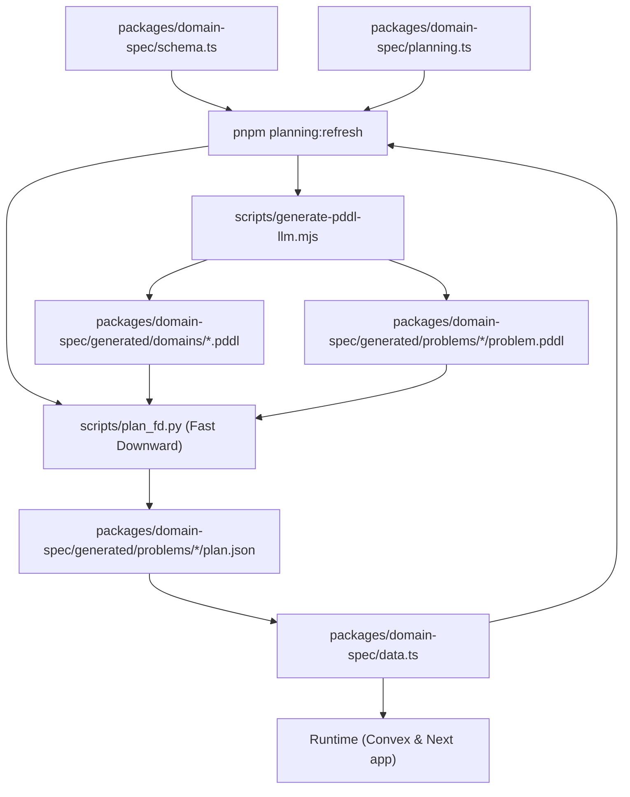

# Planning Artifact Workflow

**Flow**

1. Author or edit domain entities in `packages/domain-spec/schema.ts`, mission data in `packages/domain-spec/data.ts`, and planner verbs in `packages/domain-spec/planning.ts`.
2. Run `pnpm planning:refresh` to:
   - Generate the PDDL domain/problem via the LLM CLI (`scripts/generate-pddl-llm.mjs`).
   - Run the Fast Downward planner (`scripts/plan_fd.py`) to validate solvability.
   - Sync the resulting `plan.json` (with metadata) back into `packages/domain-spec/generated/problems/` so runtime can track progress.
3. Runtime code (`convex/gameActions.ts`, `utils/GameData.ts`) consumes the parsed bundle from `domain-spec`—including mission plans—to deliver the scenario and compare against the stored plan.

All authored truth lives in `packages/domain-spec/`; anything under `packages/domain-spec/generated/` is a derived artifact regenerated via `pnpm planning:refresh`.
