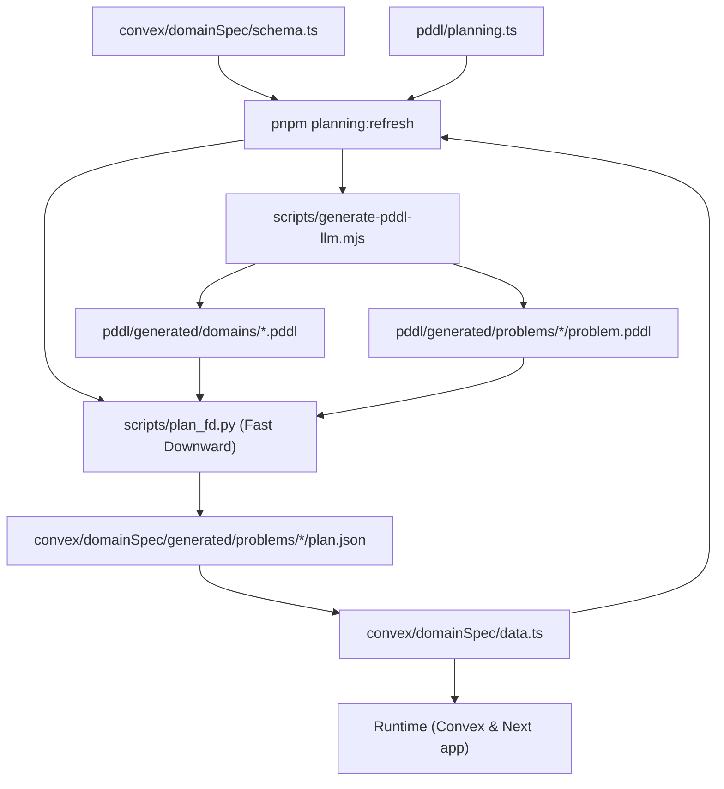

# Planning Artifact Workflow

**Flow**

1. Author or edit domain entities in `convex/domainSpec/schema.ts`, mission data in `convex/domainSpec/data.ts`, and planner verbs in `pddl/planning.ts`.
2. Run `pnpm planning:refresh` to:
   - Generate the PDDL domain/problem via the LLM CLI (`scripts/generate-pddl-llm.mjs`).
   - Write `.pddl` files to `pddl/generated/` (used by Python planner only).
   - Run the Fast Downward planner (`scripts/plan_fd.py`) to validate solvability.
   - Write the resulting `plan.json` (with metadata) to `convex/domainSpec/generated/problems/` so runtime can import it.
3. Runtime code (`convex/gameActions.ts`, `convex/gameData.ts`) imports from `convex/domainSpec/`—including mission plans—to deliver the scenario and compare against the stored plan.

**Key Separation:**

- **Convex runtime imports:** `convex/domainSpec/` (schema, data, runtime, plan.json)
- **PDDL artifacts:** `pddl/` (planning.ts, *.pddl files - NOT imported by Convex)
